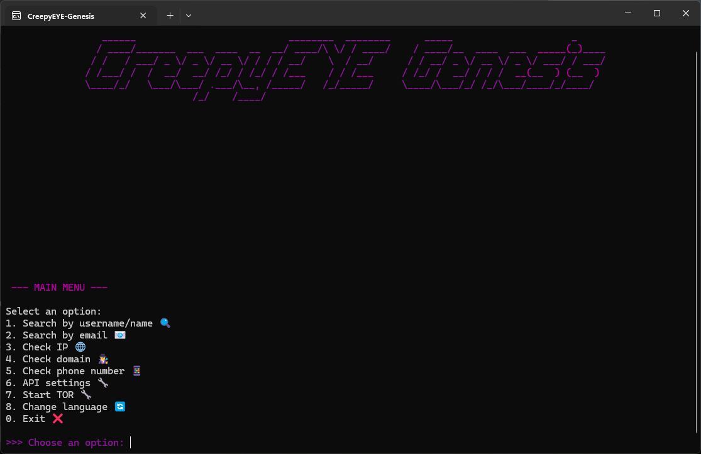
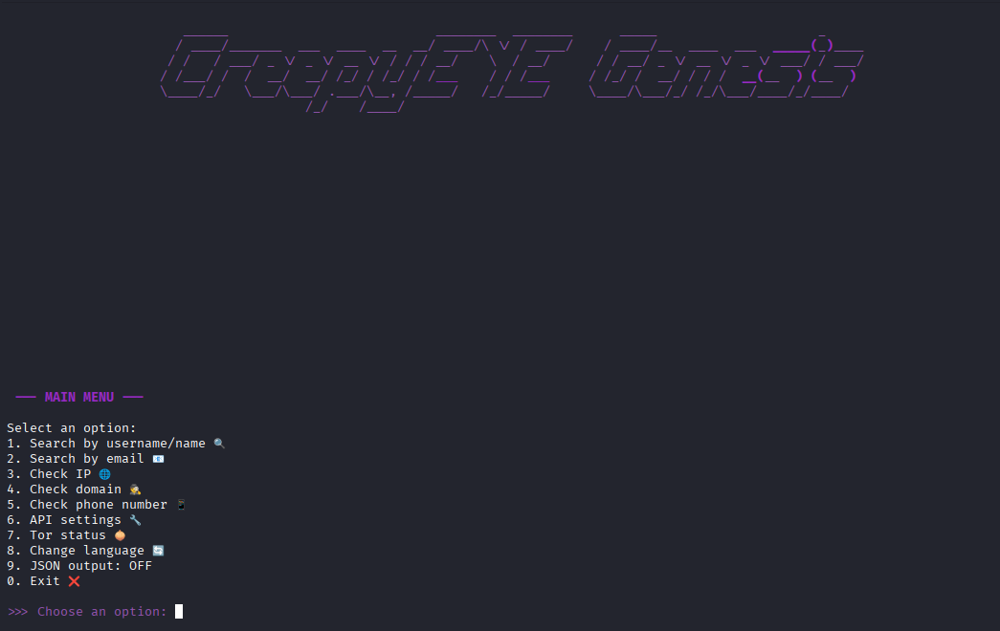
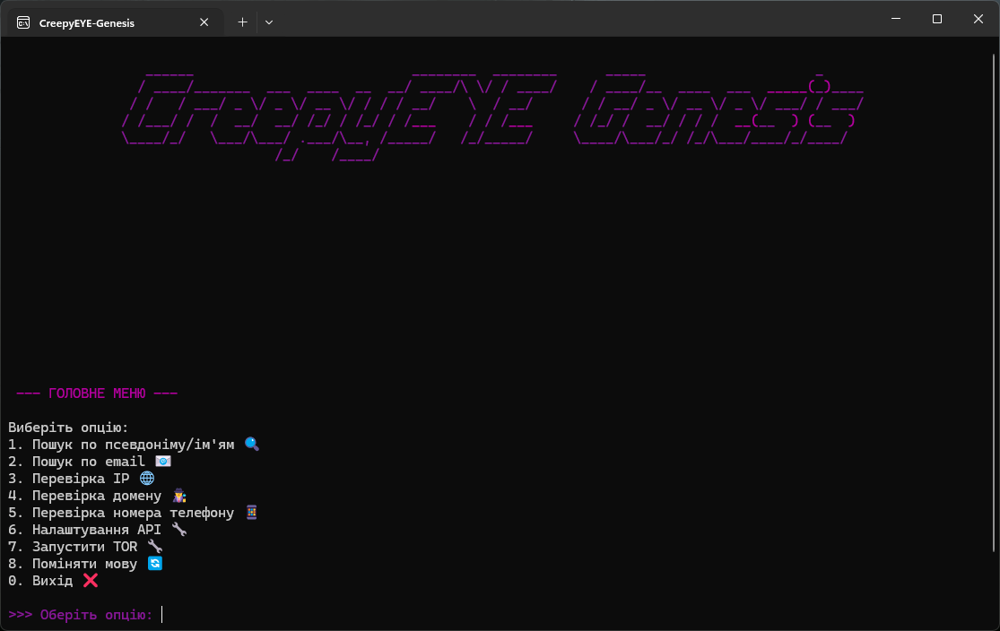
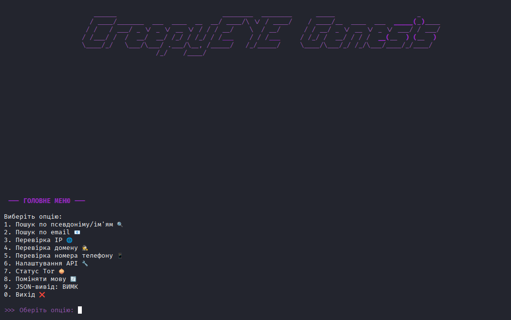
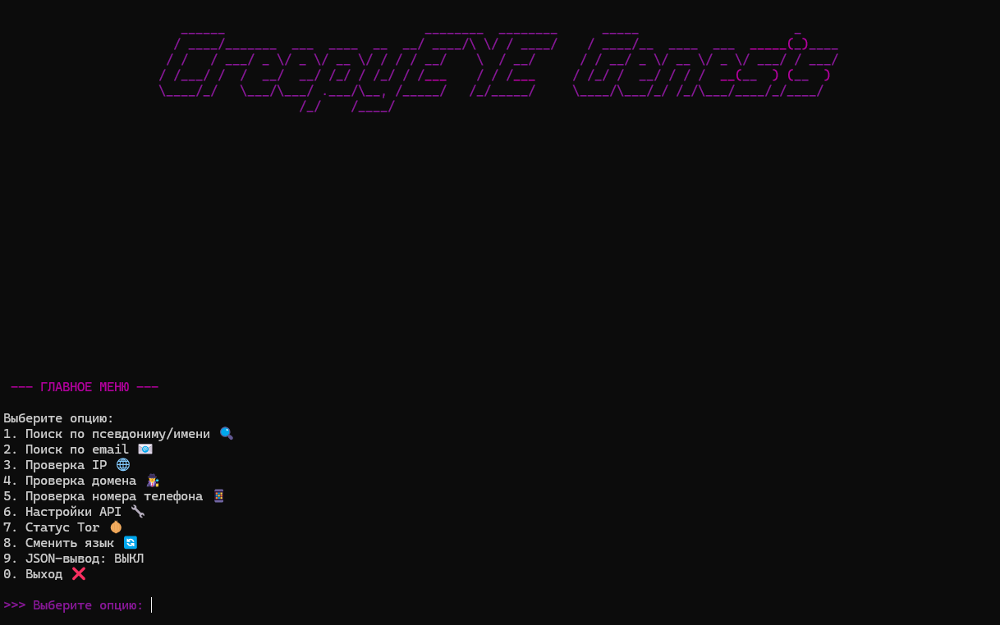
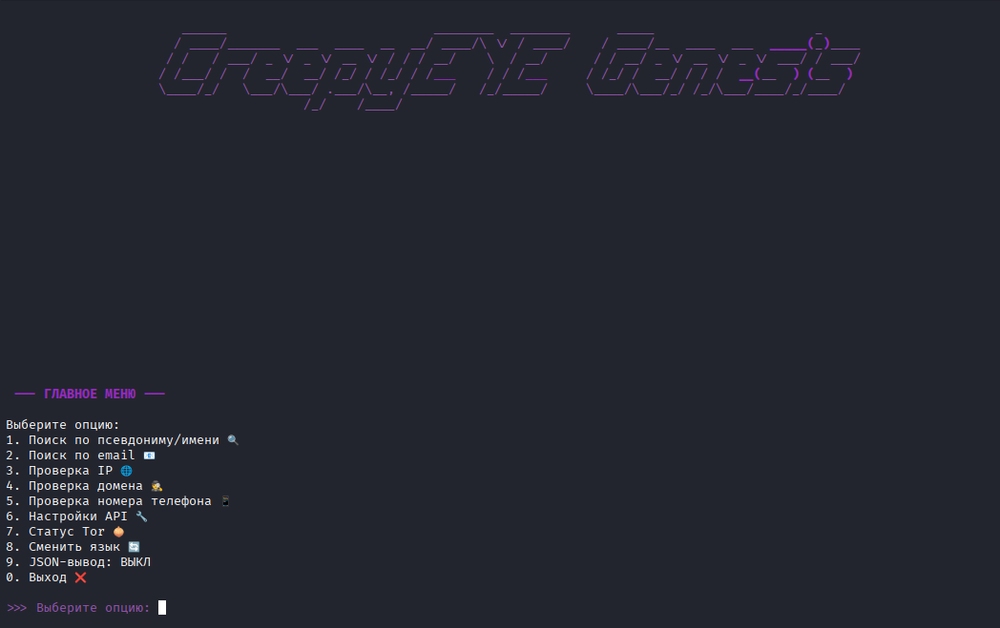

# 

 
 

 


&nbsp;

## ⚠️ IMPORTANT!
**CreepyEYE Genesis** is an OSINT (Open Source Intelligence) tool that helps you search information by username, email, IP, phone number, and other parameters across various services.  
**Use only for ethical purposes! The developers are not responsible for your actions.**

---

| Windows | Linux |
|---------|-------|
|  |  |


## 🛠️ Features

🔎 Username existence check across social media platforms:  
&nbsp;&nbsp;&nbsp;&nbsp;`GitHub`, `X`, `Instagram`, `TikTok`, `Facebook`, `GitLab`, `Bitbucket`, `Reddit`, `Twitch`, `Kaggle`, `Medium`, `SoundCloud`, `Spotify`

📧 Email verification:  
&nbsp;&nbsp;&nbsp;&nbsp;via `Hunter.io`, `EmailRep.io`  
🌐 IP/domain lookup:  
&nbsp;&nbsp;&nbsp;&nbsp;via `IPinfo`, `Shodan`, `AbuseIPDB`, `VirusTotal`, `GreyNoise`, `Whois`  
📱 Phone numbers: `Numverify`  
🧅 Tor support for anonymity  
🈯 Language selection menu (`Ukrainian` / `English` / `Russian`)  
🧾 Raw JSON output — toggled from the menu (option `9`), applies instantly  
💾 Report export — save any scan as JSON into `reports/`  
⚙️ Automatic dependency installation

---

## Example Screenshots — Multilingual

| Language | Windows | Linux |
|----------|---------|-------|
| English  |  |  |
| Ukrainian |  |  |
| Russian  |  |  |

---

## Installation

1. **Install Python 3.8+**  
   [Download Python](https://www.python.org/downloads/)

2. **Install Git**  
   - Windows: [Download Git](https://git-scm.com/downloads/win)  
   - Linux: `sudo apt update && sudo apt install git`  
   - MacOS: [Download Git](https://git-scm.com/downloads/mac)

3. **Clone the repository**  
   ```sh
   git clone https://github.com/CreepyHunterX/CreepyEYE-Genesis.git
   cd "CreepyEYE-Genesis"
   ```

4. **Install dependencies**  
   ```sh
   pip install -r requirements.txt
   ```

5. **Run the program**  
   ```sh
   python ce_genesis.py
   ```

6. **Run the tests** *(optional, for contributors)*  
   ```sh
   python -m unittest discover -s tests
   ```

---

## API Keys Setup

API keys are stored in `settings/api/api_keys.env`.  
Open it from the main menu — option **`6. API settings`**: the program creates the file from a
template if it does not exist yet, opens it in your default editor, and then asks you to restart
CreepyEYE so the new values are loaded. You can also edit the file by hand at any time.  
The template placeholders (`your_shodan_api_key`, …) are treated as missing keys, so replace the
ones you intend to use:

- SHODAN_API_KEY  
- IPINFO_TOKEN  
- ABUSEIPDB_KEY  
- HUNTER_API_KEY  
- VIRUSTOTAL_API_KEY  
- NUMVERIFY_API_KEY  
- GREYNOISE_API_KEY  
- EMAILREP_API_KEY  
- WHOIS_API_KEY  

### Where to get API keys & their usage

| Service        | API Key URL                               | Purpose                                           |
|----------------|-------------------------------------------|--------------------------------------------------|
| Shodan         | https://www.shodan.io/                    | Scan IPs, devices, open ports                    |
| IPinfo         | https://ipinfo.io/                        | Lookup IP geolocation and ASN info              |
| AbuseIPDB      | https://www.abuseipdb.com/                | Check if IP is reported for malicious activity  |
| Hunter.io      | https://hunter.io/                        | Email verification and domain search            |
| Numverify      | https://numverify.com/                     | Phone number validation                          |
| GreyNoise      | https://greynoise.io/                 | Context on internet scanners / bots             |
| EmailRep.io    | https://emailrep.io/                       | Reputation check of email addresses             |
| WhoisXML API   | https://whoisxmlapi.com/                  | WHOIS data and domain info                        |
| VirusTotal     | https://www.virustotal.com/               | Scan IPs, domains, and files for malware        |


---

## Using Tor

To increase anonymity, it’s recommended to run Tor (e.g., via Tor Browser or tor.exe).  
The program automatically detects if Tor is running and uses it for requests.

---

## JSON Output

Menu option **`9`** toggles raw JSON output (`JSON output: ON / OFF`). When it is ON, every module
also prints the unmodified API response to the terminal, which is useful for debugging or for
piping results somewhere else. The switch takes effect immediately — no restart — and it does not
change what is written into saved reports.

---

## Reports

After every scan the program asks `Save full report? (y/n)`. Answer `y` and the result is written to:

```
reports/<target>_<type>_<YYYYMMDD-HHMMSS>.json
```

The file is UTF-8 JSON and holds the tool version, the target and its type, the UTC start/finish
timestamps, whether the requests actually went through Tor, and the result of every module that ran.
API keys are stripped from the data before it is written to disk.

> ⚠️ `reports/` is listed in `.gitignore` on purpose — scan results contain information about your
> target and must not end up in forks, pull requests or issues.

---

## Important Notice

This tool is intended for ethical OSINT only.  
Use responsibly and within the law.

---

## License

[MIT License](LICENSE)

---

## 🧠 CreepyEYE PRO — out now 🎉

**CreepyEYE PRO** is the premium edition of CreepyEYE — a desktop OSINT app for **Windows and Linux**
with a **lifetime licence**: 37 integrations (bring your own API keys), scans by email, username,
domain, phone, IP, name and photo EXIF, report export, proxy and Tor support, and up to 3 devices
per key.

📖 **For full information** — installation, activation, the full service list and the CLI reference —
see **[github.com/CreepyHunterX/CreepyEYE-PRO](https://github.com/CreepyHunterX/CreepyEYE-PRO)**

🛒 **Get it at [creepycore.com](https://creepycore.com/store)**

> ℹ️ CreepyEYE PRO is closed-source and commercial. This repository stays the free and open
> **CreepyEYE Genesis** edition.

---

## 💸 Support CreepyEYE

If you enjoy CreepyEYE and want to support its development, you can do so via:

### ☕ Ko-fi
[](https://ko-fi.com/F1F71KKMAH)

### 💛 Buy Me a Coffee
[<a href="https://www.buymeacoffee.com/CreepyHunterX" target="_blank"></a>](https://buymeacoffee.com/CreepyHunterX)

Your support helps us add new APIs, improve graphics and performance, and provide stable updates. 🙌

---

### Available translations / Доступні переклади / Доступные переводы

- 🇺🇦 [Українська версія](./README_ua.md)
- 🇷🇺 [Русская Версия](./README_ru.md)
- 🇬🇧 English Version (This Translation)

---
