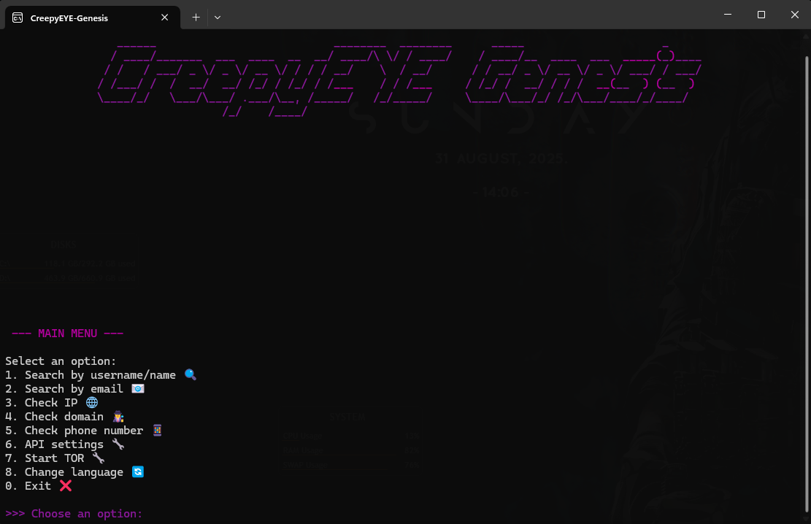
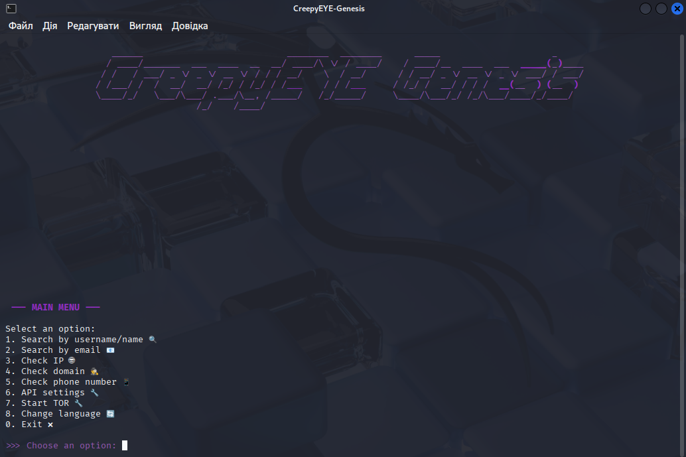
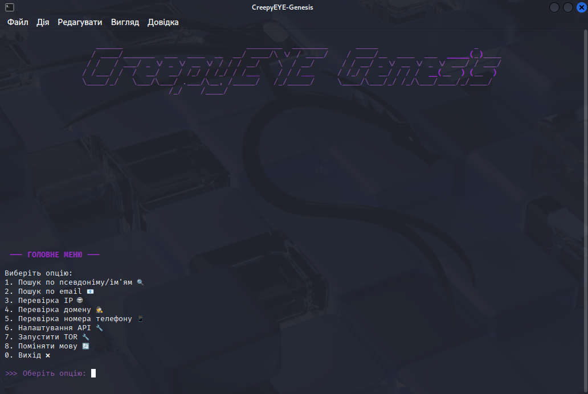
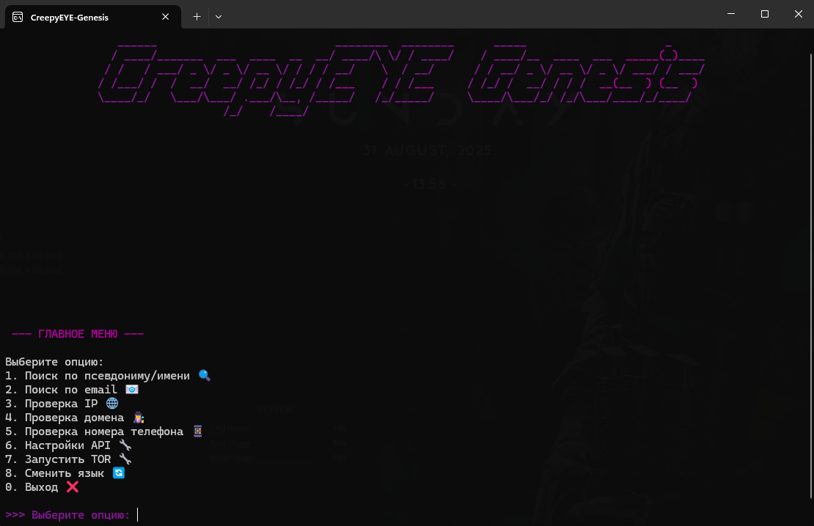
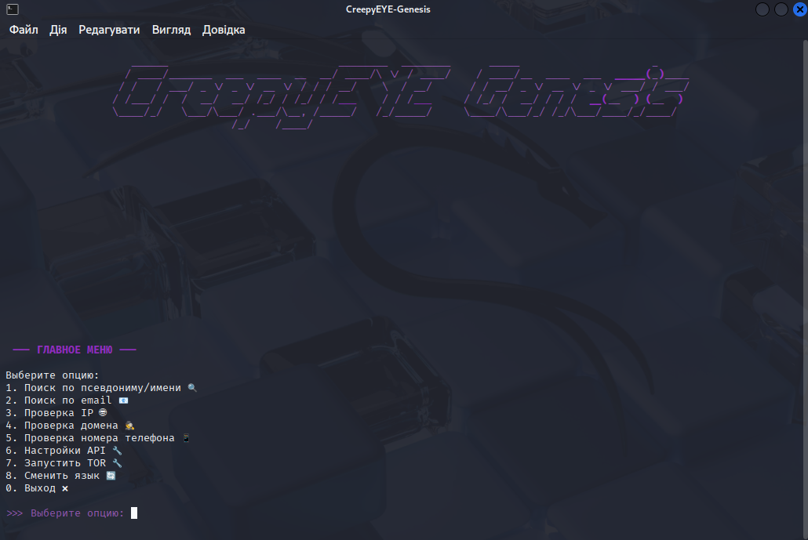

# 

 
 

 


 

## ⚠️ IMPORTANT!
**CreepyEYE Genesis** is an OSINT (Open Source Intelligence) tool that helps you search information by username, email, IP, phone number, and other parameters across various services.  
**Use only for ethical purposes! The developers are not responsible for your actions.**

---

| Windows | Linux |
|---------|-------|
|  |  |


## 🛠️ Features

🔎 Username existence check across social media platforms:  
    `GitHub`, `Twitter`, `Instagram`, `TikTok`, `Facebook`, `GitLab`, `Bitbucket`, `Reddit`, `Twitch`, `StackOverflow`, `Kaggle`, `Medium`, `SoundCloud`, `Spotify`

📧 Email verification:  
    via `Hunter.io`, `EmailRep.io`, `SpiderFoot`  
🌐 IP/domain lookup:  
    via `IPinfo`, `Shodan`, `AbuseIPDB`, `VirusTotal`, `GreyNoise`, `Whois`, `SpiderFoot`  
📱 Phone numbers: `Numverify`  
🧅 Tor support for anonymity  
🈯 Language selection menu (`Ukrainian` / `English` / `Russian`)  
⚙️ Automatic dependency installation

---

## Example Screenshots — Multilingual

| Language | Windows | Linux |
|----------|---------|-------|
| English  |  |  |
| Ukrainian |  |  |
| Russian  |  |  |

---

## Installation

1. **Install Python 3.8+**  
   [Download Python](https://www.python.org/downloads/)

2. **Install Git**  
   - Windows: [Download Git](https://git-scm.com/downloads/win)  
   - Linux: `sudo apt update && sudo apt install git`  
   - MacOS: [Download Git](https://git-scm.com/downloads/mac)

3. **Clone the repository**  
   ```sh
   git clone https://github.com/CreepyHunterX/CreepyEYE-Genesis.git
   cd "CreepyEYE-Genesis"
   ```

4. **Install dependencies**  
   ```sh
   pip install -r requirements.txt
   ```

5. **(Optional) Install [SpiderFoot](https://github.com/smicallef/spiderfoot)**  
   To use SpiderFoot features, install it separately:  
   ```sh
   git clone https://github.com/smicallef/spiderfoot.git
   cd spiderfoot
   pip install -r requirements.txt
   ```  
   After installation, return to the CreepyEYE Genesis directory to run the main program.

6. **Run the program**  
   ```sh
   python ce_genesis.py
   ```

---

## API Keys Setup

When you start the program, you will have an option to create or open the API keys file (`settings/api/api_keys.env`).  
You can add or modify keys in this file anytime.  
Open the file and insert your keys:

- SHODAN_API_KEY  
- IPINFO_TOKEN  
- ABUSEIPDB_KEY  
- HUNTER_API_KEY  
- VIRUSTOTAL_API_KEY  
- NUMVERIFY_API_KEY  
- GREYNOISE_API_KEY  
- EMAILREP_API_KEY  
- WHOIS_API_KEY  

### Where to get API keys & their usage

| Service        | API Key URL                               | Purpose                                           |
|----------------|-------------------------------------------|--------------------------------------------------|
| Shodan         | https://www.shodan.io/                    | Scan IPs, devices, open ports                    |
| IPinfo         | https://ipinfo.io/                        | Lookup IP geolocation and ASN info              |
| AbuseIPDB      | https://www.abuseipdb.com/                | Check if IP is reported for malicious activity  |
| Hunter.io      | https://hunter.io/                        | Email verification and domain search            |
| Numverify      | https://numverify.com/                     | Phone number validation                          |
| GreyNoise      | https://greynoise.io/                 | Context on internet scanners / bots             |
| EmailRep.io    | https://emailrep.io/                       | Reputation check of email addresses             |
| WhoisXML API   | https://whoisxmlapi.com/                  | WHOIS data and domain info                        |
| VirusTotal     | https://www.virustotal.com/               | Scan IPs, domains, and files for malware        |


---

## Using Tor

To increase anonymity, it’s recommended to run Tor (e.g., via Tor Browser or tor.exe).  
The program automatically detects if Tor is running and uses it for requests.

---

## Important Notice

This tool is intended for ethical OSINT only.  
Use responsibly and within the law.

---

## 🧠 CreepyEYE PRO (Development Roadmap)

> 🔥 *CreepyEYE PRO* is a ⚡ **premium version** of our OSINT tool with over **30 integrated APIs**,  
> enabling deep searches, link mapping, encrypted session storage, and more.  
> Perfect for OSINT pros, cyber intelligence, and digital forensics.

---

### 🛠️ Planned Features

- ✅ **Over 30 integrated APIs** (HaveIBeenPwned, Hunter.io, Shodan, and more)  
- 🔍 **Deep search** for Telegram, IP, email, username, domains  
- 🧩 **Graph View** — visualization of related entities  
- 💾 **History and session saving with encryption option**  
- 🛡️ **TOR / VPN mode support**  
- 🖥️ **CLI + Web GUI** (Flask / FastAPI)  
- 🐳 **Docker and Windows EXE builds**  
- 🌐 **Auto-translation and multilingual support**

---

### 📌 Example APIs planned

| Category        | APIs                                |
|-----------------|-------------------------------------|
| Username lookup | `GitHub`, `Reddit`, etc.            |
| Email check     | `Hunter.io`, `EmailRep`, etc.       |
| IP/Domain       | `Shodan`, `IPinfo`, etc.            |
| Passwords/leaks | `HaveIBeenPwned`, `LeakCheck`, etc. |
| Phones          | `Numverify`, `PhoneInfoga`, etc.    |

> ⚠️ Full API list will be published closer to release.

---

## 💸 Support CreepyEYE

If you enjoy CreepyEYE and want to support its development, you can do so via:

### ☕ Ko-fi
[](https://ko-fi.com/F1F71KKMAH)

### 💛 Buy Me a Coffee
[<a href="https://www.buymeacoffee.com/CreepyHunterX" target="_blank"></a>](https://buymeacoffee.com/CreepyHunterX)

Your support helps us add new APIs, improve graphics and performance, and provide stable updates. 🙌

---

### Available translations / Доступні переклади / Доступные переводы

- 🇺🇦 [Українська версія](./README_ua.md)
- 🇷🇺 [Русская Версия](./README_ru.md)
- 🇬🇧 English Version (This Translation)

---
